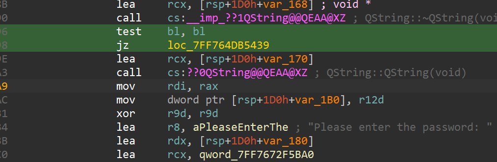
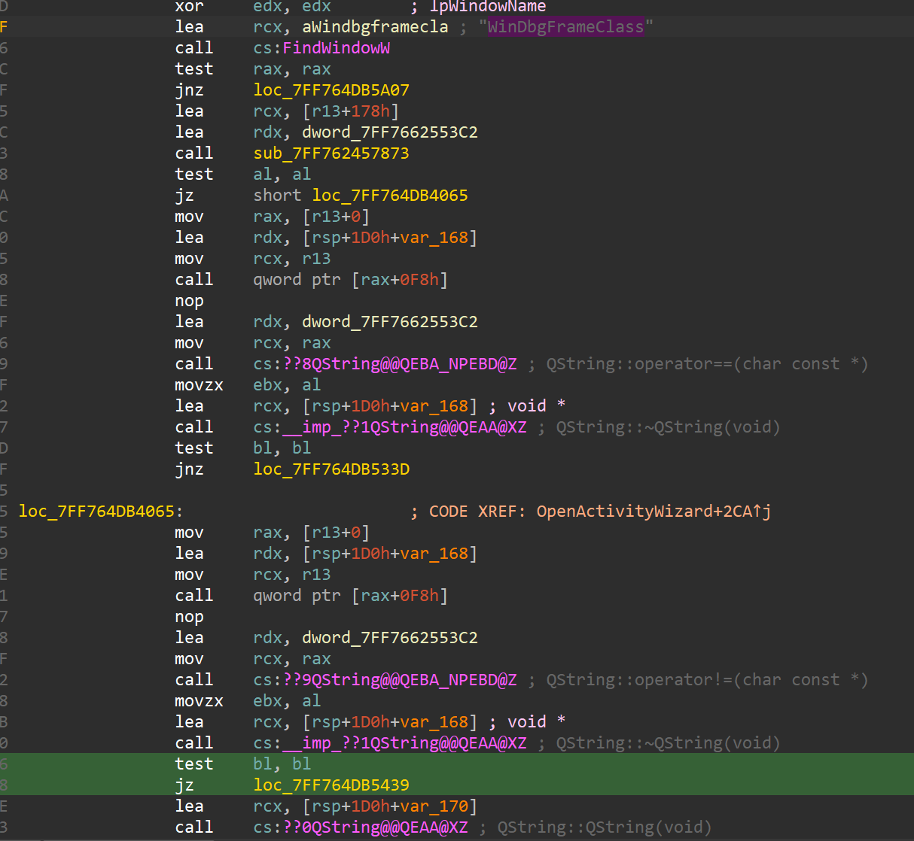

# Packet tracer recovery

Only tested on 8.2.1 

Make sure to put dll and exe in the same directory

once patched, packet tracer won't ask you for any password

## How could I update it

### String XREF

Search for " Delete all device dialogs"

Scroll down until you see the jz just before the "Please enter the password: "

Now what you need to modify is the jz, you need to transform it to a JMP

### FindWindow

Since they are checking in this exact same function if there are debugger present, you can use that to actually find this function. 

